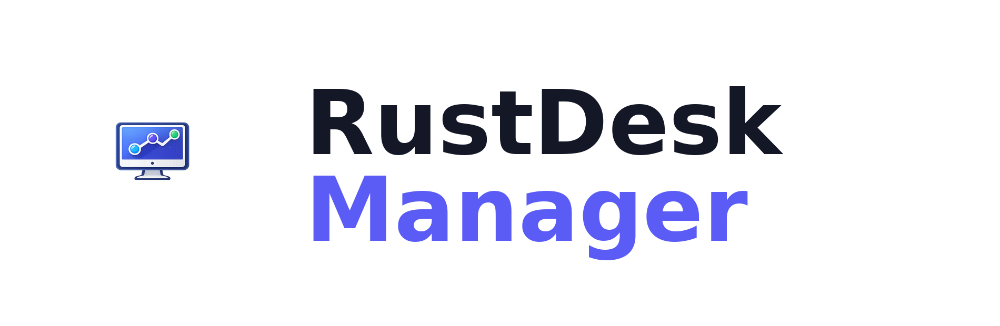

# RustDesk Manager

Aplicación de escritorio para gestionar conexiones RustDesk de forma centralizada. Sincroniza automáticamente con tu servidor API de RustDesk y permite organizar equipos en categorías y grupos.



## Características

- **Sincronización automática** con servidor API RustDesk
- **Detección de estado** online/offline en tiempo real
- **Organización jerárquica** por categorías y grupos
- **Conexión directa** con un clic (requiere RustDesk instalado)
- **Transferencia de archivos** integrada
- **Multiidioma**: Español, English, Français
- **Tema claro/oscuro**
- **Import/Export** de configuración y datos
- **Multiplataforma**: macOS y Windows

## Requisitos previos

Para usar RustDesk Manager necesitas:

| Componente | Descripción | Documentación |
|------------|-------------|---------------|
| **RustDesk** | Cliente de escritorio remoto instalado en tu equipo | [rustdesk.com](https://rustdesk.com/) |
| **Servidor RustDesk** | Servidor hbbs/hbbr (propio o público) | [Guía de instalación](servidor/index.md) |
| **API Server** | Panel web y API REST para gestionar equipos | [lejianwen/rustdesk-api](https://github.com/lejianwen/rustdesk-api) |

!!! tip "¿No tienes servidor propio?"
    Puedes usar los servidores públicos de RustDesk, pero no tendrás sincronización automática de equipos. La app funcionará solo con equipos añadidos manualmente.

## Empezar

### :material-download: Instalación

Descarga e instala RustDesk Manager en macOS o Windows.

[:octicons-arrow-right-24: Guía de instalación](guia/instalacion.md)

### :material-cog: Configuración

Conecta la app con tu servidor RustDesk API.

[:octicons-arrow-right-24: Configuración inicial](guia/configuracion.md)

### :material-server: Montar servidor

Instala tu propio servidor RustDesk self-hosted.

[:octicons-arrow-right-24: Guía del servidor](servidor/index.md)

### :material-script: Desplegar clientes

Scripts automatizados para instalar RustDesk en equipos remotos.

[:octicons-arrow-right-24: Scripts de despliegue](deployment/index.md)

## Arquitectura del sistema

```
┌─────────────────────────────────────────────────────────────────┐
│                         TU SERVIDOR                              │
│                                                                  │
│   ┌─────────────┐  ┌─────────────┐  ┌─────────────────────┐    │
│   │    hbbs     │  │    hbbr     │  │    rustdesk-api     │    │
│   │  (ID Srv)   │  │   (Relay)   │  │   (Panel web/API)   │    │
│   └─────────────┘  └─────────────┘  └─────────────────────┘    │
│                                              │                   │
└──────────────────────────────────────────────│───────────────────┘
                                               │
                                               ▼
┌─────────────────────────────────────────────────────────────────┐
│                      RUSTDESK MANAGER                            │
│                                                                  │
│   Sincroniza equipos ←→ API Server                              │
│   Organiza por categorías y grupos                              │
│   Conecta vía cliente RustDesk local                            │
└─────────────────────────────────────────────────────────────────┘
```

## Licencia

MIT License - [Ver licencia completa](https://github.com/angelbonet/rustdesk-manager/blob/main/LICENSE)

---

**abDatabase** · [abdatabase.com](https://abdatabase.com) · [GitHub](https://github.com/angelbonet)
